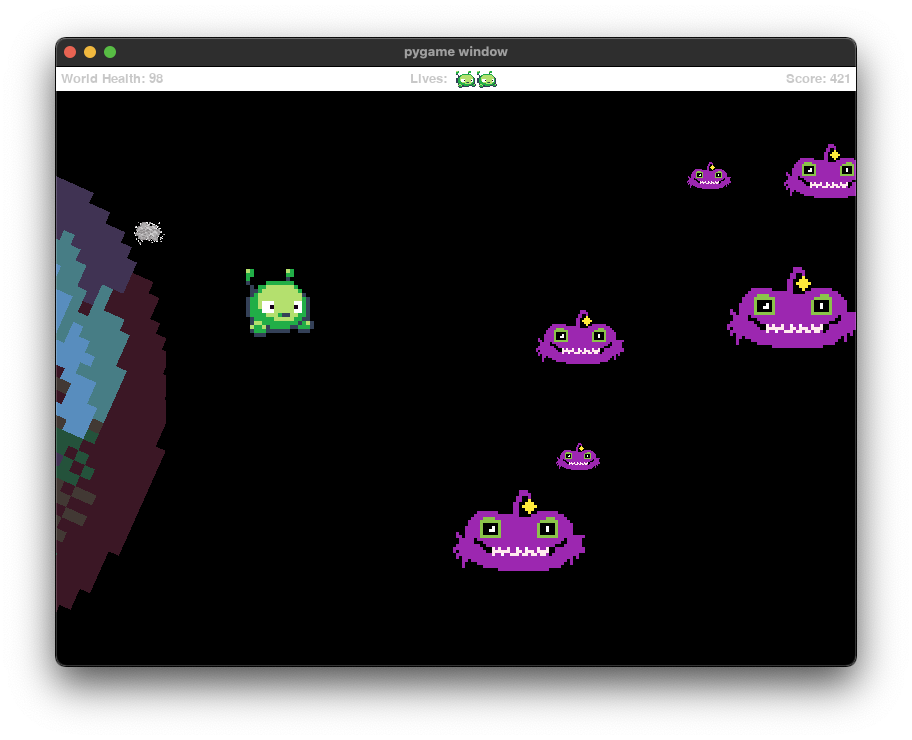

# Game Jame Halloween 2021 - Final Space

What is a Game Jam?
"Jam" is a reference to musical jam sessions. Similarly, the goal with a "game jam" is to come together and make a video game, or a non-digital (analog) game like a board game or card game. Participants rapidly prototype game designs and inject new ideas to help inspire and grow the global game and interactive software industries. We share a common theme (**An Astronomical Apocalypse**) and constraints. We ask participants to create a game from beginning to end in a prescribed time. The brief time span is meant to help encourage creative thinking which results in small but innovative and experimental games, some of which have been developed beyond the game jam into a commercial success. (Adapted from GGJ)

## Screenshots




## Running from source

```bash
pipenv install pygame
pipenv run python game.py
```

## Compile to app/exe

To use the following, you must have Python3.10+ installed and be using it within pipenv to compile the app

### MacOS (only one tested)

```bash
pipenv install
pipenv run python setup.py py2app 
```

### Windows

```bash
pipenv install
pipenv run python setup.py py2exe 
```

### Linux

```bash
pipenv install
pipenv run python setup.py 
```
